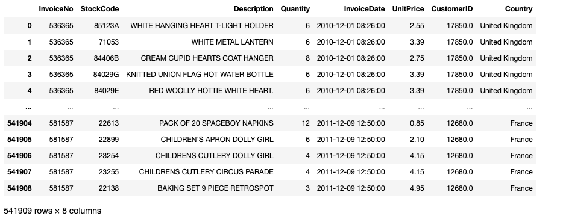
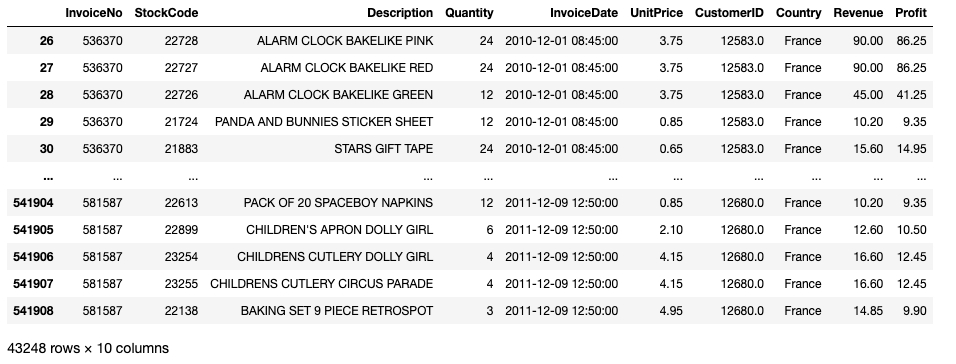
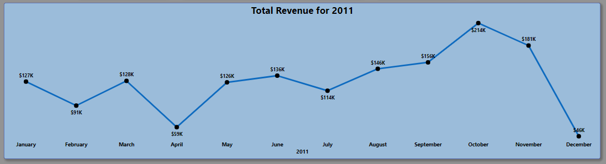
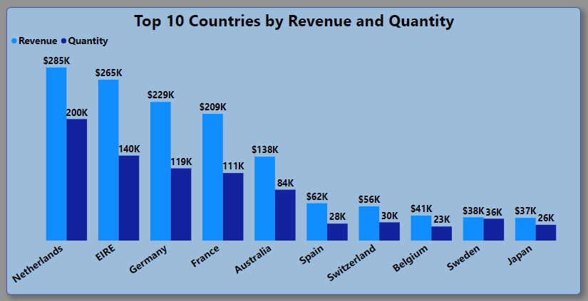
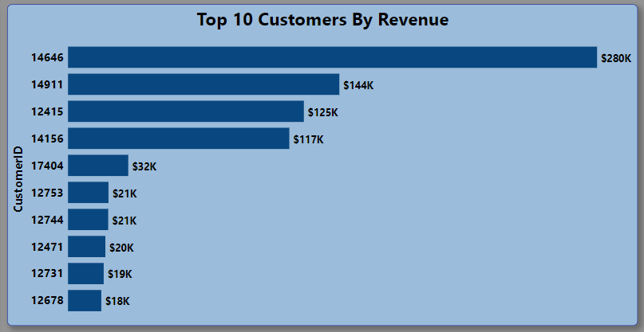
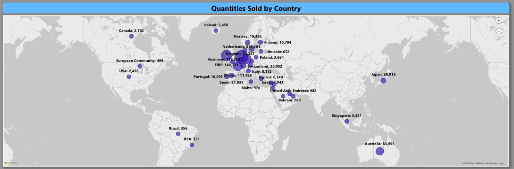
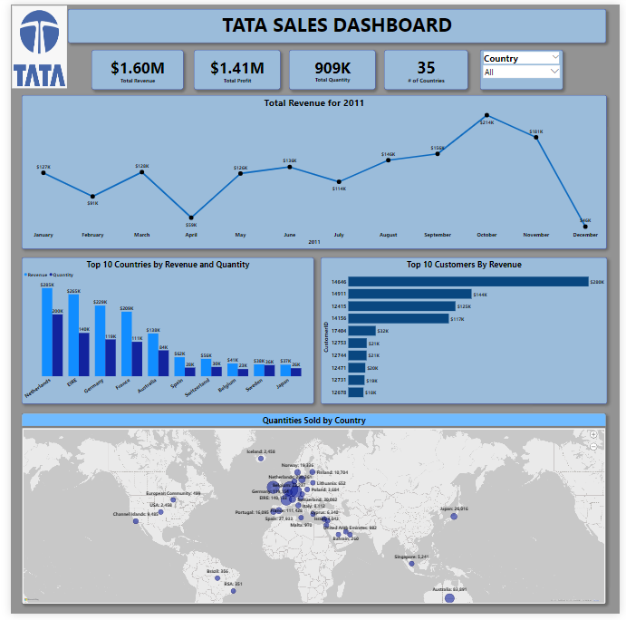

# TATA Sales Analysis

# Introduction

This project was done as a part of the TATA virtual internship program on the Forage platform. Tata Group, an Indian conglomerate, operates in over 100 countries across six continents. Its mission is to enhance the well-being of communities worldwide by creating long-term stakeholder value through trustworthy leadership. In the fiscal year 2021-22, TATA group generated a revenue of $128 billion (INR 9.6 trillion) and employed more than 935,000 people through its various companies. Among these, twenty-nine (29) Tata enterprises are publicly listed and many hold leading positions in their respective industries. This virtual experience program is affiliated with one of TATA’s companies, Tata Insights and Quants (Tata iQ). During the program, I gained valuable insights into how various team tackle intricate business challenges using data visualization tools Power BI. This project demonstrated how we can gain compelling narratives that are garnered from vast amounts of generated data.

# Problem Statements

During this analysis, the Chief Executive Officer (CEO) and the Chief Marketing Officer (CMO) sought insights on four primary questions to assist in strategic and operational decision-making.

### **Question 1**

The CEO of the retail store is interested to view the time series of the revenue data for the year 2011 only. He would like to view granular data by looking into revenue for each month. The CEO is interested in viewing the seasonal trends and wants to dig deeper into why these trends occur. This analysis will be helpful for the CEO to forecast for the next year.

### **Question 2**

The CMO is interested in viewing the top 10 countries which are generating the highest revenue. Additionally, the CMO is also interested in viewing the quantity sold along with the revenue generated. The CMO does not want to have the United Kingdom in this visual.

### **Question 3**

The CMO of the online retail store wants to view the information on the top 10 customers by revenue. He is interested in a visual that shows the greatest revenue generating customer at the start and gradually declines to the lower revenue generating customers. The CMO wants to target the higher revenue generating customers and ensure that they remain satisfied with their products.

### **Question 4**

The CEO is looking to gain insights on the demand for their products. He wants to look at all countries and see which regions have the greatest demand for their products. Once the CEO gets an idea of the regions that have high demand, he will initiate an expansion strategy which will allow the company to target these areas and generate more business from these regions. He wants to view the entire data on a single view without the need to scroll or hover over the data points to identify the demand. There is no need to show data for the United Kingdom as the CEO is more interested in viewing the countries that have expansion opportunities.

# Data Wrangling and Transformation

The dataset was retrieved from the forage website, you can view the dataset [HERE](https://1drv.ms/x/s!AkzQCgPQpnXMgWUMSaxNit2Swmxb?e=BwQVI5). The dataset contained 541,909 rows and 8 columns. It included the following information:

1. **_InvoiceNo_**: A unique number or code assigned to a specific invoice, which is a document issued by TATA to the customer detailing the products or services purchased and the payment terms.

2. **_StockCode_**: A distinct code or identifier used to represent a particular product or item in a TATA’s inventory or stock management system.

3. **_Description_**: A brief explanation providing details about a product. 

4. **_Quantity_**: The numerical value representing the number of items of a particular product or service that is bought.

5. **_InvoiceDate_**: The specific date on which an invoice was issued indicating when a transaction took place between TATA and the customer.

6. **_UnitPrice_**: The price assigned to one unit of a product or service.

7. **_CustomerID_**: A unique identification number or code assigned to each customer allowing TATA to track and manage its interactions with specific customers.

8. **_Country_**: A geographic region that is identified as the location of a customer.

## Data Cleaning Process

Data cleaning is a critical step in the analysis process to ensure the quality, reliability, and validity of the findings derived from the dataset. It lays a solid foundation for meaningful and actionable insights which enables businesses to make informed decisions based on trustworthy data. The following steps were taken to clean the dataset before analysis which was done using Python programming:

-	**The data was checked for any duplicates**: It revealed that it contained 5,268 duplicated values. These were removed from the dataset. 

-	**The data was checked for any null values**: The dataset included 135,037 null values. These were dropped from the dataset. 

-	**Changing datatypes where necessary**: Since the _CustomerID_ was an indication of a categorical variable within the dataset, I changed its datatype from float type to a string. 

-	**Checking the country column**: This column was checked to identify any anomalies. It was shown that there were countries that were marked as _Unspecified_. In order to get a more accurate depiction of the various countries and their purchases, the countries that were marked as _Unspecified_ were dropped from the dataset. I also dropped the United Kingdom from the dataset as it was not needed for analysis.

-	**Checking the quantity column**: I noticed that there were quantities that were being reported in the negatives. These were removed from the dataset.

-	**Checking the unit price column**: I also checked to ensure that there was no unit price below $0. Any data that was found to correspond with this anomaly was dropped from the dataset.

-	**Creating a revenue and profit column**: In order to effectively answer the questions above, I  calculated the revenue and profit. 

To view the data cleaning process and the codes that were used, [Click HERE]( http://localhost:8888/notebooks/TATA%20Data%20Cleaning.ipynb).

 Original Dataset                                 |                     Cleaned Dataset
:---------------------------------------------:   | :------------------------------------------------:
                         | 

# Data Analysis and Visualization

## Total Revenue for Year 2011

There has been a fluctuation in revenue for the year of 2011. The lowest revenue earned was in December with a value of $45,809 while the highest revenue earned was in the month of October with a value of $214,422. 

## Top 10 Countries by Revenue and Quantity

The country that garnered the highest revenue was the Netherlands with a total revenue of $285,446 and total quantity sold being 200,361 units. Meanwhile, the country with the lowest revenue ($37,416) and quantity sold (26,016 units) was Japan.

## Top 10 Customers by Revenue 

The customer with the highest amount in revenue was **Customer 14646** with a total revenue of $280,206.

## Quantity Demanded Over Regions

 

The European region has a greater demand for TATA’s products. The Netherlands amassed 200,361 units, EIRE, 140,133 units, Germany 119,154 units and France 111,428 units. It should also be noted that Australia demanded a total of 83,891 units with Japan representing the Asian region with 26,016 units.

## Dashboard

 
 

You can interact with the dashboard [HERE]( https://www.novypro.com/project/tata-virtual-internship---sales-dashboard)

# Conclusion and Recommendations

## Conclusion:

The dataset retrieved from the Forage website contained extensive information about TATA's transactions, including details of invoices, products, quantities, prices, customer IDs, and countries. To ensure the accuracy and reliability of the findings, a rigorous data cleaning process was conducted using Python programming. During the data cleaning process, duplicate entries and null values were removed to eliminate redundancy and ensure data integrity. Additionally, anomalies in the country column were addressed by dropping unspecified countries and excluding the United Kingdom from the analysis. Negative quantities and unit prices below $0 were also removed, preserving the dataset's consistencies.
After cleaning the data, further analysis revealed significant insights. The revenue fluctuated throughout the year 2011, with October recording the highest revenue of $214,422 and December the lowest at $45,809. The Netherlands emerged as the top revenue-generating country, with $285,446 in revenue and 200,361 units sold. On the other hand, Japan had the lowest revenue and quantity sold, with $37,416 in revenue and 26,016 units. The customer with the highest revenue was identified as Customer 14646, contributing a total revenue of $280,206. The European region showed a greater demand for TATA's products, with the Netherlands, EIRE, Germany, and France being the top countries in terms of units sold.

## Recommendations:

1. Market Focus: Given the strong demand in the European region, TATA should consider expanding its presence and marketing efforts in countries like the Netherlands, EIRE, Germany, and France to further capitalize on this lucrative market.

2. Customer Engagement: To maintain a strong relationship with valuable customers, TATA should focus on understanding the needs and preferences of customers like Customer 14646 who significantly contribute to TATA’s revenue.

3. Inventory Management: Since some products experienced negative quantities, TATA should investigate the reasons behind this issue and implement better inventory management practices to avoid stockouts and overstock situations.

4. Data Collection: To improve data quality, TATA should ensure that data collection processes are thorough and consistent, reducing the occurrence of missing or erroneous data points.

5. Market Expansion: While Europe shows promising performance, exploring growth opportunities in regions like Australia and other Asian countries can help diversify TATA's market presence and revenue sources.

By implementing these recommendations and continuing to emphasize data quality, TATA can leverage the insights gained from this analysis to make well-informed decisions, drive growth, and enhance its position in the global market.

